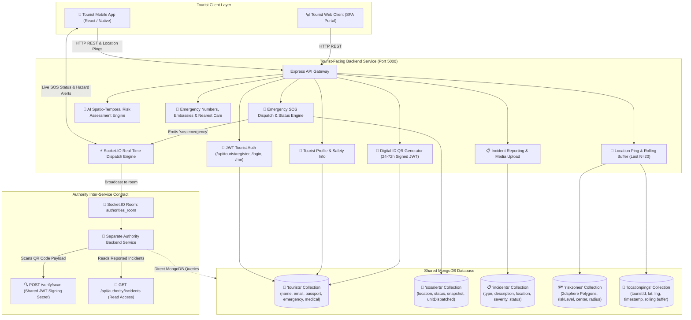

# 🛡️ Tourist Safety Platform — Tourist-Facing Backend

[](https://nodejs.org/)
[](https://expressjs.com/)
[](https://www.mongodb.com/)
[](https://socket.io/)
[](LICENSE)

An intelligent, real-time backend platform engineered for the **tourist-facing mobile and web clients** of a comprehensive Tourist Safety Platform. It provides instant emergency dispatch via **one-tap SOS**, tamper-proof **Digital Tourist Identity cards with cryptographically signed QR codes**, **2dsphere geospatial geofencing** with active hazard warnings, rolling location telemetry, incident reporting, and an **AI Spatio-Temporal Risk Assessment Engine** with contextual natural-language safety advisories.

Built with **Node.js, Express.js, MongoDB (Mongoose), Socket.IO, and JWT authentication**, this backend is designed for complete interoperability with the Authority backend through **shared MongoDB collections** (`tourists`, `sosalerts`, `incidents`, `riskzones`, `locationpings`) and a **documented REST API contract** (`/verify/scan`, `/api/authority/incidents`, and Socket.IO room events).

---

## 🏛️ System Architecture & Authority Integration



---

## 🔗 Inter-Service Contracts with Authority Backend

This backend can operate in **two production deployment modes** alongside the Authority backend:

### 1. Shared MongoDB Collections Mode
Both services connect to the same MongoDB database (`tourist_safety`):
- **`tourists` Collection**:
  - Minimum fields: `name`, `email`, `passwordHash`, `nationality`, `passportNumber`, `phone`, `emergencyContact` (`{ name, phone, relation }`), `itinerary[]`, `medicalNotes` (`{ bloodGroup, allergies, conditions, notes }`), `digitalIdToken`, `digitalIdExpiry`, `tripDates`, `accommodation`, `preferredLanguage`.
- **`sosalerts` Collection**:
  - Minimum fields: `touristId`, `location: { lat, lng }`, `geoPoint` (2dsphere), `message` / `note`, `voiceNoteUrl`, `status` (`'active'`, `'acknowledged'`, `'unit_dispatched'`, `'resolved'`, `'cancelled'`), `priorityScore`, `touristProfileSnapshot`, `assignedUnit` (`{ unitId, unitName, eta, dispatchedAt }`), `acknowledgedAt`, `resolvedAt`, `cancelledAt`.
- **`incidents` Collection**:
  - Minimum fields: `touristId` / `reportedBy`, `type` (`theft`, `harassment`, `scam`, `accident`, `other`), `description`, `location: { lat, lng, address }`, `timestamp`, `photoUrl`, `mediaUrls[]`, `severity` (`low`, `medium`, `high`, `critical`), `status` (`open`, `investigating`, `resolved`), `aiAnalysis`.
- **`riskzones` Collection**:
  - Minimum fields: `name`, `description`, `riskLevel` (`low`, `medium`, `high`, `critical`), `category`, `location` (GeoJSON Polygon), `geometry`, `center: { lat, lng }`, `radiusMeters`, `active`.
- **`locationpings` Collection**:
  - Minimum fields: `touristId`, `lat`, `lng`, `location: { lat, lng }`, `timestamp`, `activeRiskZones[]`. Rolling buffer cleans up points older than last $N=20$.

### 2. REST API & WebSocket Contract Mode
When communicating across isolated network boundaries:
- **Digital ID Scan Verification**: `POST /verify/scan` (or `POST /api/authority/verify/scan`) accepts `{ qrCodePayload }` or `{ token }`, validates the cryptographic HMAC signature (`DIGITAL_ID_SECRET` or `JWT_SECRET`), checks expiration, and returns verified tourist medical/contact details while redacting sensitive passport files.
- **Incident Read Feed**: `GET /api/authority/incidents` provides authenticated read access with status, type, severity, and bounding-box filters.
- **Real-Time SOS Channel**: Socket.IO broadcasts `sos:emergency` to `authorities_room` and emits `sos:status_updated` / `sos:cancelled` across rooms.

---

## 🚀 Quick Start Guide

### Prerequisites
- **Node.js**: v18.x or v20+
- **MongoDB**: Local MongoDB instance (`mongodb://127.0.0.1:27017/tourist_safety`) or MongoDB Atlas.
  > 💡 **Zero-Config Fallback**: If local MongoDB is not running, the server automatically starts an **in-memory MongoDB instance** (`mongodb-memory-server`) for instantaneous zero-config testing!

### 1. Installation
```bash
npm install
```

### 2. Environment Configuration
Copy `.env.example` to `.env`:
```bash
cp .env.example .env
```
*(Defaults are configured out of the box).*

### 3. Seed Realistic Demo Dataset
Populates 3 mock tourists (`Maya Lin`, `Carlos Gomez`, `Emily Watson`), 2 authority officers, pre-generated signed Digital IDs, 2dsphere risk zones, and realistic historical incidents:
```bash
npm run seed
```

### 4. Run Development Server
```bash
npm run dev
# or for production:
npm start
```
The server will boot on `http://localhost:5000` with WebSockets active on `ws://localhost:5000`.

### 5. Run Automated Verification Test Suite
```bash
npm test
# or:
node verify.js
```
Runs 26 exhaustive assertions across all 8 features with 100% pass rate.

---

## 📡 Complete Tourist API Reference

All routes are mounted under `/api/tourist` (with root aliases supported).

### 🔐 Authentication
| Method | Endpoint | Description |
| :--- | :--- | :--- |
| `POST` | `/api/tourist/register` | Register tourist with `name`, `email`, `password`, `nationality`, `passportNumber`, `phone`, `emergencyContact`. Creates records in `tourists` collection and returns JWT. |
| `POST` | `/api/tourist/login` | Login with email & password; returns JWT token. |
| `GET` | `/api/tourist/me` | Fetch authenticated tourist profile and account details. |

### 👤 Feature 1 — Tourist Profile & Safety Information
| Method | Endpoint | Description |
| :--- | :--- | :--- |
| `GET` | `/api/tourist/profile` | Retrieve tourist profile: trip dates, itinerary, accommodation, emergency contacts, medical notes (allergies/conditions), preferred language. |
| `PUT` | `/api/tourist/profile` | Update profile fields (`tripDates`, `itinerary`, `accommodation`, `emergencyContact`, `medicalNotes`, `preferredLanguage`, `passportNumber`). |
| `GET` | `/api/tourist/safety-info` | Fetch destination-specific safety guidelines, emergency hotline numbers, local laws, and medical advisories for the tourist's current destination. |

### 🎫 Feature 2 — Digital Tourist ID (QR)
| Method | Endpoint | Description |
| :--- | :--- | :--- |
| `POST` | `/api/tourist/id/generate` | Generates a short-lived (24–72h, default 48h), renewable signed JWT encoding `touristId` + trip validity window + medical notes. Renders base64 PNG QR code via `qrcode`. |
| `GET` | `/api/tourist/id` | Fetch current active Digital ID token, expiration, and base64 QR code image. |
| `POST` | `/verify/scan` | **Authority Inter-Service Endpoint**: Validates scanned QR payload signature, checks validity, increments verification metric, and returns verified tourist identity. |

### 📍 Feature 3 — Location-Based Safety
| Method | Endpoint | Description |
| :--- | :--- | :--- |
| `POST` | `/api/tourist/location/update` | Periodic GPS ping (`{ lat, lng, speed, batteryLevel }`). Evaluates 2dsphere geofence against active `RiskZone` perimeters. Prunes history to maintain a **rolling buffer of last N=20 points**. |
| `GET` | `/api/tourist/location/alerts` | Given coordinates (or tourist's last known ping), returns all active risk zones and warnings within specified radius. |

### 🚨 Feature 4 — Emergency / SOS
| Method | Endpoint | Description |
| :--- | :--- | :--- |
| `POST` | `/api/tourist/sos/trigger` | Creates an `SOSAlert` with GPS coordinates, distress note/voice note, tourist profile snapshot, and AI urgency score. Immediately emits `sos:emergency` over Socket.IO to `authorities_room`. Returns `sosId`. |
| `GET` | `/api/tourist/sos/:sosId/status` | Poll or subscribe to status changes: `active` ➔ `acknowledged` ➔ `unit_dispatched` (+ETA) ➔ `resolved`. |
| `POST` | `/api/tourist/sos/:sosId/cancel` | Allows tourist cancellation for accidental false alarms; broadcasts cancellation to authorities. |

### 🗺️ Feature 5 — Risk & Safety Alerts
| Method | Endpoint | Description |
| :--- | :--- | :--- |
| `POST` | `/api/admin/risk-zones` | Admin/seed endpoint to register or update `RiskZone` data (name, polygon/radius, riskLevel, description). |
| `GET` | `/api/tourist/alerts/nearby` | Proactive push-style endpoint returning active risk perimeters and high-severity incidents near tourist's last known location. |

### 📋 Feature 6 — Incident Reporting
| Method | Endpoint | Description |
| :--- | :--- | :--- |
| `POST` | `/api/tourist/incidents` | Report incident: type (`theft`/`harassment`/`scam`/`accident`/`other`), description, location, timestamp, optional photo upload (URL/base64/Multer), severity. Evaluated by AI classifier. |
| `GET` | `/api/tourist/incidents/mine` | Retrieve tourist's own submitted incident reports and investigation statuses. |
| `GET` | `/api/authority/incidents` | **Authority Read Access**: Exposes full incident list with filters for investigation dispatch. |

### 🧠 Feature 7 — AI / Smart Feature
| Method | Endpoint | Description |
| :--- | :--- | :--- |
| `POST` | `/api/tourist/ai/assess-risk` | Takes tourist's location + time of day + nearby incident/risk zone context. Computes an AI risk score (0–100), risk level, and a **contextual natural-language safety tip** (e.g. *"This area has had 3 reported incidents after 9pm — consider traveling with others"*). |
| `POST` | `/api/tourist/ai/incident-triage` | Auto-categorizes free-text incident descriptions into standard incident type, severity rating, and priority dispatch score. |

> 🤖 **AI Engine Implementation Note (for Demo / Presentation)**:
> The AI Risk Engine uses a hybrid architecture:
> 1. **External LLM Integration**: If `GEMINI_API_KEY`, `OPENAI_API_KEY`, or `ANTHROPIC_API_KEY` is present in `.env`, the engine constructs contextual prompts and calls the LLM for natural-language safety tip synthesis.
> 2. **Deterministic Offline Heuristic Classifier**: If no external API key is provided, the backend executes an internal spatial-temporal time-decay clustering model and NLP lexical classifier with zero latency, ensuring 100% reliable live video demonstrations without API rate limit or outage risks.

### 🏥 Feature 8 — Safety Resources
| Method | Endpoint | Description |
| :--- | :--- | :--- |
| `GET` | `/api/tourist/resources` | Returns 24/7 emergency numbers (police: `112`, ambulance: `108`, tourist helpline: `1363`), embassy directory matched to tourist's nationality (Canada, USA, UK, Australia, Spain, Germany, etc.), local guidelines, and geo-nearest hospital / police stations with distance calculations. |

---

## ⚡ Socket.IO Real-Time Event Architecture

Connect to `ws://localhost:5000` with JWT in `auth: { token: "<token>" }`:

| Event | Channel / Room | Description |
| :--- | :--- | :--- |
| `sos:emergency` | `authorities_room` | Dispatched instantly on SOS trigger with GPS, medical summary, and snapshot. |
| `sos:status_updated` | `authorities_room` & `tourist_<id>` | Emitted when authority acknowledges, dispatches unit (+ETA), or resolves alert. |
| `sos:cancelled` | `authorities_room` & `tourist_<id>` | Emitted when tourist cancels false alarm. |
| `hazard:warning` | `tourist_<id>` | Direct real-time push alert when tourist's GPS ping breaches a declared risk zone. |
| `tourist:zone_entry` | `authorities_room` | Emitted to authorities when a tourist enters a `high` or `critical` danger zone. |
| `incident:new` | `authorities_room` | Broadcast when a new incident report is submitted. |

---

## 👥 Demo User Credentials

Run `npm run seed` to load these pre-configured accounts:

| Role | Name | Email | Password | Details |
| :--- | :--- | :--- | :--- | :--- |
| **Admin** | Chief Commissioner Rajesh Varma | `admin@safety.gov` | `Password123!` | System administrator, Zone: `Central Zone` |
| **Dispatcher** | Dispatcher Kavita Sen | `dispatcher.kavita@safety.gov` | `Password123!` | Emergency CAD dispatcher, Zone: `Central Zone` |
| **Authority** | Inspector Vikram Rao | `officer.vikram@safety.gov` | `Password123!` | Patrol Commander, Zone: `Central Zone` |
| **Authority** | Officer Sarah Jenkins | `officer.sarah@police.gov` | `Password123!` | Harbor Patrol, Zone: `Coastal Sector` |
| **Tourist 1** | Maya Lin | `maya.lin@gmail.com` | `Password123!` | Canada, Blood Group O+, Asthma, Active Digital ID |
| **Tourist 2** | Carlos Gomez | `carlos.gomez@yahoo.es` | `Password123!` | Spain, Blood Group A-, Active Itinerary |
| **Tourist 3** | Emily Watson | `emily.watson@outlook.co.uk` | `Password123!` | UK, Blood Group B+ |

---

## 🛡️ Authority & Monitoring Backend (Police & Dispatcher Center)

This service is used by police and tourism department personnel with two core responsibilities:
1. **Tourist Digital ID Verification & Audit Logging**: QR token signature verification, profile inspection with masked PII, fraud/tamper flagging, and immutable verification audit logs.
2. **SOS Dispatch Management**: Real-time zone-based emergency reception via Socket.io, multi-stage lifecycle (new → acknowledged → unit_dispatched → resolved / escalated), response unit registry, and bidirectional live updates.

### 🔑 Authentication & Role Middleware

- `POST /api/auth/authority/login` — Email + password, rate-limited via `express-rate-limit`. Returns JWT containing role (`authority`, `dispatcher`, `admin`) and jurisdiction/zone.
- Middleware `authenticateAuthority` — Verifies JWT and restricts access to authority, dispatcher, and admin personnel.
- Middleware `authorizeRole(["admin"])` — Guards administrative routes.

---

### 🪪 MODULE 1 — TOURIST ID VERIFICATION

| Method | Endpoint | Description |
| :--- | :--- | :--- |
| `GET` | `/api/authority/tourists/verify/:touristId` | Looks up tourist by Digital Tourist ID or User ID. Returns full name, photo, nationality, masked passport (`***-XXXX`, last 4 digits only), itinerary dates, emergency contacts, trip validity (`active`/`expired`), and verification status flag. Writes audit log. |
| `POST` | `/api/authority/tourists/verify/scan` | Accepts scanned QR payload (signed JWT), verifies cryptographic signature and expiry server-side. Returns full tourist record or a clear `invalid`/`expired`/`tampered` response. Writes result to `VerificationLog`. |
| `POST` | `/api/authority/tourists/:touristId/flag` | Allows an officer to flag a tourist record (e.g. suspected fraud, lost ID) with a reason and timestamp. Updates status to `flagged`. |
| `GET` | `/api/authority/tourists/verify/log` | Audit log of all verification scans (who verified, when, where, result, tourist details) with pagination and filtering. |

**Audit Log Collection (`VerificationLog`)**:
Every verification action records `{ officerId, touristId, timestamp, location, result, verificationMethod, reason, notes }` for compliance and auditability.

---

### 🚨 MODULE 2 — SOS DISPATCH MANAGEMENT

| Method | Endpoint | Description |
| :--- | :--- | :--- |
| `GET` | `/api/authority/sos/active` | Lists all open/unresolved SOS alerts (`new`, `active`, `acknowledged`, `unit_dispatched`, `escalated`), sorted by severity (`critical` → `high` → `medium` → `low`) then recency. Each includes tourist details, live GPS, timestamp, status, and overdue indicator (>2 mins without acknowledgment). |
| `POST` | `/api/authority/sos/:sosId/acknowledge` | Authority acknowledges receipt of an SOS, timestamps it, notifies the tourist app via Socket.io (`sos:acknowledged`). |
| `POST` | `/api/authority/sos/:sosId/dispatch` | Assigns a response unit (`{ unitId, unitType, eta, notes }`). Updates SOS status to `unit_dispatched`, updates response unit status to `dispatched`, and broadcasts assigned unit + ETA back to the tourist via Socket.io in real time. |
| `GET` | `/api/authority/units` | Lists response units with type, status (`available`/`dispatched`/`maintenance`), zone, and last known location. Filterable by zone, status, and type. |
| `POST` | `/api/authority/units` | Registers or updates a response unit (unitId, type, zone, status, currentLocation, contactNumber, callSign, vehiclePlate). |
| `POST` | `/api/authority/sos/:sosId/resolve` | Marks an SOS as resolved with closing note. Releases assigned response unit back to `available` and emits real-time Socket.io updates. |
| `POST` | `/api/authority/sos/:sosId/escalate` | Escalates an unresolved or overdue SOS. Elevates severity to `critical`, flags visually as overdue on the dashboard, and pushes high-priority alarm via Socket.io. |

---

### ⚡ Real-Time Socket.IO Zone Rooms

- When an authority or dispatcher connects, their JWT claims place them automatically into:
  - Global `authorities_room`
  - Targeted zone room: `zone_<jurisdiction>` (e.g. `zone_central_zone`, `zone_coastal_sector`)
- When a tourist triggers SOS, the payload pushes directly to their jurisdiction's room without polling.
- Real-time events:
  - `sos:emergency` — New emergency triggered
  - `sos:acknowledged` — Officer acknowledged alert
  - `sos:unit_dispatched` — Response unit assigned with ETA
  - `sos:resolved` — Emergency resolved
  - `sos:escalated` — Overdue/high-threat escalation
  - `unit:status_updated` — Response unit status change

---

## 📂 Project Directory Structure

```
Tourist-Safety-platform/
├── controllers/
│   ├── authController.js                 # Tourist & Authority login/register
│   ├── authorityController.js            # Dashboard summary & situational queries
│   ├── authoritySosController.js         # Module 2: SOS dispatch & unit lifecycle
│   ├── authorityVerificationController.js # Module 1: ID verification & audit logs
│   ├── digitalIdController.js            # Tourist-facing QR generation & verification
│   ├── incidentController.js             # Incident reporting, triage & AI clustering
│   ├── locationController.js             # Pings, rolling buffer (N=20), & geo-alerts
│   ├── riskZoneController.js             # Risk zones & AI predicted clusters
│   ├── safetyController.js               # Safety guidelines & CMS resources
│   ├── sosController.js                  # Tourist SOS trigger, status poll, & cancel
│   └── touristController.js              # Tourist profile CRUD & safety info
├── middleware/
│   ├── auth.js                           # authenticateAuthority, authorizeRole, protect
│   ├── errorHandler.js                   # Standardized { success, message, data } errors
│   ├── rateLimiter.js                    # Rate limiters for auth and SOS endpoints
│   └── upload.js                         # Multer disk storage for photo uploads
├── models/
│   ├── AuthorityUser.js                  # Authority user model
│   ├── DigitalTouristID.js               # Signed QR metadata, flags, & expiry
│   ├── Incident.js                       # Incidents with 2dsphere geoPoint & AI analysis
│   ├── LocationPing.js                   # GPS telemetry with rolling buffer cleanup
│   ├── ResponseUnit.js                   # Emergency response units (Patrol, Medical, Van)
│   ├── RiskZone.js                       # GeoJSON Polygon / Circular zones (2dsphere)
│   ├── SafetyResource.js                 # Emergency hotlines, embassies & guidelines
│   ├── SOSAlert.js                       # SOS alerts with assignedUnit, status, escalation
│   ├── TouristProfile.js                 # Medical, emergency contacts, masked passport
│   ├── User.js                           # Core user schema (tourist, authority, dispatcher, admin)
│   └── VerificationLog.js                # Immutable audit logs for ID verifications
├── routes/
│   ├── authRoutes.js                     # /api/auth & /api/auth/authority/login
│   ├── authorityRoutes.js                # Module 1 & Module 2 /api/authority/* routes
│   ├── incidentRoutes.js                 # /api/incidents routes
│   ├── locationRoutes.js                 # /api/location routes
│   ├── riskZoneRoutes.js                 # /api/risk-zones routes
│   ├── safetyRoutes.js                   # /api/safety routes
│   ├── sosRoutes.js                      # /api/sos routes
│   └── touristRoutes.js                  # /api/tourist routes
├── utils/
│   ├── aiClassifier.js                   # NLP threat urgency & severity classifier
│   ├── aiRiskEngine.js                   # Spatio-temporal decay clustering
│   ├── db.js                             # MongoDB connection + in-memory fallback
│   ├── geoUtils.js                       # Haversine distance & ray-casting algorithms
│   └── socket.js                         # Socket.IO zone rooms & broadcast helpers
├── verify-authority.js                   # 29-test Authority verification test suite
├── verify.js                             # 26-test Tourist verification test suite
├── seed.js                               # Database seeder (Admin, Units, SOS, Logs)
├── server.js                             # Express HTTP + Socket.IO server
└── README.md                             # System documentation
```

---

## 📜 Submission Details

- **Project**: Tourist-Facing Backend • Tourist Safety Platform
- **Repository**: [https://github.com/SanjitRS/Tourist-Safety-platform](https://github.com/SanjitRS/Tourist-Safety-platform)
- **Author**: SanjitRS
- **License**: MIT