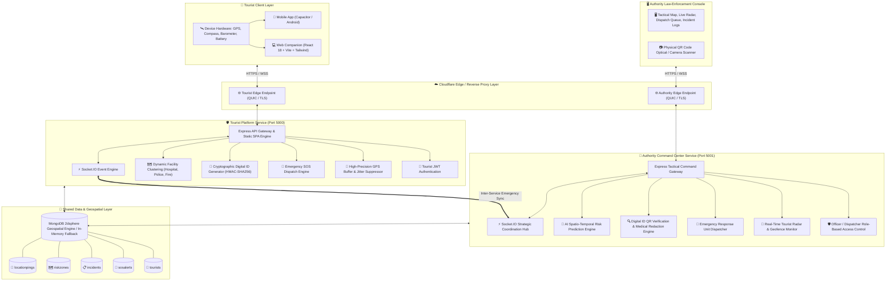

# 🛡️ SafeYatra — Intelligent Tourist Safety & Tactical Authority Platform

[](https://nodejs.org/)
[](https://react.dev/)
[](https://www.typescriptlang.org/)
[](https://vitejs.dev/)
[](https://tailwindcss.com/)
[](https://expressjs.com/)
[](https://www.mongodb.com/)
[](https://socket.io/)
[](https://cloudflare.com/)
[](https://www.docker.com/)
[](https://opensource.org/licenses/MIT)

**SafeYatra** is a comprehensive, production-grade tourist safety ecosystem designed to safeguard travelers across hazardous corridors, remote Himalayan trails, and bustling metropolitan hubs. 

The platform bridges **tourists** and **emergency law-enforcement authorities** through real-time hardware GPS telemetry, instant SOS distress dispatch, cryptographically verified Digital Tourist QR IDs, 2dsphere geospatial geofencing, and AI-powered spatio-temporal risk clustering.

---

## 📑 Table of Contents

- [🏛️ System Architecture](#️-system-architecture)
- [✨ Key Platform Features](#-key-platform-features)
  - [📱 Tourist Safety Companion](#-tourist-safety-companion)
  - [👮 Authority Tactical Command Center](#-authority-tactical-command-center)
  - [🧠 AI Risk & Urgency Engine](#-ai-risk--urgency-engine)
- [📂 Repository Structure](#-repository-structure)
- [🔗 Inter-Service Architecture & API Contracts](#-inter-service-architecture--api-contracts)
- [🚀 Quickstart & Local Setup](#-quickstart--local-setup)
- [👤 Demo Access Credentials](#-demo-access-credentials)
- [☁️ Cloud Deployment Guide](#️-cloud-deployment-guide)
  - [1. Cloudflare Quick Edge Tunnels](#1-cloudflare-quick-edge-tunnels-zero-config)
  - [2. Google Cloud Run Deployment](#2-google-cloud-run-deployment)
  - [3. Render 1-Click Deployment](#3-render-1-click-deployment)
- [🔒 Security & Privacy Architecture](#-security--privacy-architecture)
- [📜 License](#-license)

---

## 🏛️ System Architecture

SafeYatra employs a **decoupled, microservice-ready architecture** supporting both independent scaling and unified tactical coordination:



---

## ✨ Key Platform Features

### 📱 Tourist Safety Companion
- **Real-Time GPS Tracking & Map Pinning**:
  - Live hardware GPS coordinates acquisition via `navigator.geolocation` with sub-10m precision.
  - Automatic IP-based fallback geolocator (`ipwho.is` / `ip-api`) when hardware GPS is unavailable indoors.
  - Interactive search bar to search any address/city or click anywhere on the tactical map to drop a custom pin.
- **Dynamic Emergency Facilities Clustering**:
  - Automatically calculates and renders the **3 nearest emergency services** relative to the tourist’s live pin:
    - 🏥 **Hospitals & Emergency Trauma Centers**
    - 👮 **Police Stations & Tourist Assistance Booths**
    - 🚒 **Fire Stations & Search-and-Rescue Hubs**
  - Displays instant distance in kilometers, estimated travel times, and one-tap emergency calling.
- **Fail-Safe SOS Distress System**:
  - **Hold-to-Trigger Panic Button**: Ergonomic 1.8-second hold mechanism prevents accidental pocket activations while ensuring rapid distress signaling during emergencies.
  - Transmits full 3D telemetry: Latitude, Longitude, Altitude, Device Battery Level, and Timestamp.
  - Real-time response tracking: Tourist receives live status updates (*Triggered* → *Acknowledged* → *Patrol Unit Dispatched* → *Resolved*).
- **Cryptographically Signed Digital Tourist ID**:
  - Issues a tamper-proof QR code embedded with a signed JWT payload (HMAC-SHA256).
  - Displays emergency contacts, blood group, medical allergies, passport validation, and trip validity.
- **Multi-Hazard Geospatial Geofencing**:
  - Color-coded hazard overlays on interactive OpenStreetMap tiles:
    - 🟢 **Safe Corridor**: Verified tourist pathways with high security presence.
    - 🟠 **Caution Ridge**: Moderate hazard requiring vigilance (e.g., steep terrain, low lighting).
    - 🔴 **High Hazard Geofence**: Active danger zone (e.g., landslide risks, rapid weather degradation).
  - Instant advisory alerts triggered when a tourist crosses a geofenced boundary.
- **Offline Safety Guides & Emergency Directory**:
  - Critical helpline directory (112 Universal, 100 Police, 108 Ambulance, 101 Fire, 1363 Tourist Helpline).
  - Works offline with persistent local caching.

---

### 👮 Authority Tactical Command Center
- **Unified Tactical Radar Map**:
  - Complete live operational overview displaying active tourists, distress beacons, deployed patrol units, and hazard perimeters.
  - Interactive filters: view *All*, *Distress Points Only*, *Hazard Polygons*, or *Patrol Units*.
- **Emergency Dispatch & Unit Routing**:
  - Real-time SOS dispatch queue prioritizing critical emergencies.
  - Assign specific response units (PCR Vans, Mountain Rescue Teams, Ambulances) with automatic ETA calculation.
- **Digital ID QR Verification Console**:
  - High-assurance optical/payload scanner for checkpoint officers and field patrols.
  - Instant cryptographic signature verification against the shared signing secret.
  - **Zero-Knowledge Medical Redaction**: Discloses vital medical info (blood group, allergies, emergency contacts) while masking confidential documents.
- **Risk Zone GIS Management**:
  - Define, expand, or deactivate geospatial risk zones dynamically with custom radius and advisory text.
- **Automated Tourist In-Zone Audit**:
  - Query all tourists currently located within any selected hazard polygon in one click.

---

### 🧠 AI Risk & Urgency Engine
- **Spatial Incident Clustering**:
  - Evaluates historical incident telemetry (thefts, scams, accidents, harassment) to detect hazard hotspots.
- **Predictive Risk Scoring (0 - 100)**:
  - Calculates contextual risk ratings and auto-generates tactical mitigation recommendations for field commanders.
- **Emergency NLP Urgency Classifier**:
  - Analyzes SOS notes and incoming messages to categorize severity (*Critical*, *High*, *Medium*, *Low*) for priority dispatching.

---

## 📂 Repository Structure

```plaintext
SafeYatra/
├── Authority part/                 # Authority Tactical Command Center Service
│   ├── controllers/                # Authority API business logic
│   ├── middleware/                 # JWT authentication & rate limiting
│   ├── models/                     # Mongoose schemas (shared contract)
│   ├── public/                     # High-assurance HTML/JS Command Console
│   ├── routes/                     # REST routes (/authority, /sos, /risk-zones)
│   ├── utils/                      # Database & Socket.IO initializers
│   ├── Dockerfile                  # Production container configuration
│   ├── package.json                # Authority service dependencies
│   ├── server.js                   # Node.js Express server (Port 5001)
│   └── verify.js                   # Automated test verification script
│
├── Toursit Site/                   # Tourist Safety Platform Service
│   ├── controllers/                # Tourist API controllers
│   ├── frontend/                   # Modern React 18 + Vite frontend application
│   │   ├── src/
│   │   │   ├── components/common/  # TacticalMap (Leaflet GIS), GlobalHeader
│   │   │   ├── lib/                # safetyStore.tsx (State & Location Engine), api.ts
│   │   │   ├── pages/
│   │   │   │   ├── tourist/        # TouristHome, LocationSafetyMap, SosFlow, DigitalId
│   │   │   │   └── authority/      # Embedded Authority Dashboard & Live SOS Feed
│   │   │   ├── App.tsx             # Client routes & navigation layout
│   │   │   └── main.tsx            # Application root
│   │   ├── package.json            # Frontend dependencies
│   │   └── vite.config.ts          # Vite build configuration
│   ├── models/                     # Shared database schemas
│   ├── routes/                     # REST routes (/auth, /tourist, /location, /sos)
│   ├── utils/                      # DB connection & Socket.IO hub
│   ├── Dockerfile                  # Multi-stage production container build
│   ├── package.json                # Tourist backend dependencies
│   ├── server.js                   # Express server serving API + Built React SPA (Port 5000)
│   └── seed.js                     # Realistic demo database seeder
│
├── deploy-gcp.ps1                  # Automated Google Cloud Run deployment script
├── render.yaml                     # Infrastructure-as-code blueprint for Render
└── README.md                       # Comprehensive platform documentation
```

---

## 🔗 Inter-Service Architecture & API Contracts

Both applications operate as independent microservices while maintaining bidirectional interoperability:

### 📡 Core REST Endpoints

| Service | Method | Route | Description | Auth Required |
| :--- | :---: | :--- | :--- | :---: |
| **Tourist** | `POST` | `/api/auth/register` | Register new tourist profile | No |
| **Tourist** | `POST` | `/api/auth/login` | Authenticate tourist and obtain JWT | No |
| **Tourist** | `POST` | `/api/location/ping` | Ingest live GPS coordinates & check geofences | Yes (Tourist) |
| **Tourist** | `POST` | `/api/sos` | Broadcast emergency SOS distress beacon | Yes (Tourist) |
| **Tourist** | `GET` | `/api/tourist/digital-id` | Retrieve cryptographically signed Digital ID QR | Yes (Tourist) |
| **Tourist** | `GET` | `/api/risk-zones` | Retrieve all active 2dsphere risk polygons | No |
| **Authority** | `POST` | `/api/authority/login` | Authenticate officer / dispatcher | No |
| **Authority** | `GET` | `/api/authority/tourists/live-locations` | Live radar telemetry feed of active tourists | Yes (Authority) |
| **Authority** | `POST` | `/verify/scan` | Verify scanned Digital ID QR code payload | Yes (Authority) |
| **Authority** | `GET` | `/api/authority/tourists-in-zone` | Audit all tourists inside a risk zone | Yes (Authority) |
| **Authority** | `POST` | `/api/authority/sos/:id/dispatch` | Dispatch response unit to emergency | Yes (Authority) |
| **Authority** | `GET` | `/api/risk-zones/predicted` | AI spatio-temporal risk clusters & scores | No |

### ⚡ Real-Time WebSocket Events (Socket.IO)

- `sos:emergency` → Emitted immediately when a tourist triggers distress; broadcast to all law-enforcement dispatchers.
- `tourist:location_update` → Broadcasts rolling GPS coordinates to tactical radar.
- `sos:status_updated` → Notifies the distressed tourist when help is acknowledged or dispatched.

---

## 🚀 Quickstart & Local Setup

### Prerequisites
- **Node.js** v18+ (v20+ recommended)
- **npm** v9+ or **bun**
- (Optional) **Docker** & **Git**

### 1. Clone the Repository
```bash
git clone https://github.com/SanjitRS/Tourist-Safety-platform.git
cd Tourist-Safety-platform
```

### 2. Setup & Run the Tourist Safety App (Port 5000)
```bash
cd "Toursit Site"

# Install backend dependencies
npm install

# Install and build frontend application
cd frontend
npm install
npm run build
cd ..

# Start Tourist Platform (serves API, WebSocket, and React SPA)
npm start
```
- 🌐 **Tourist Safety App**: `http://localhost:5000`

### 3. Setup & Run the Authority Command Center (Port 5001)
In a separate terminal:
```bash
cd "Authority part"

# Install dependencies
npm install

# Start Authority Service
npm start
```
- 👮 **Authority Tactical Console**: `http://localhost:5001/portal`

> [!NOTE]
> Both services include built-in zero-config **MongoDB Memory Server** fallbacks. If no external MongoDB instance is running, an in-memory database will automatically spin up and self-seed with realistic demo data.

---

## 👤 Demo Access Credentials

The platform comes pre-seeded with sample role accounts for testing:

| Role | Email | Password | Assigned Zone / Scope |
| :--- | :--- | :--- | :--- |
| 👑 **Administrator** | `admin@safety.gov` | `Password123!` | Central Command Zone |
| 📡 **Emergency Dispatcher** | `dispatcher.kavita@safety.gov` | `Password123!` | Central Zone Emergency Ops |
| 👮 **Police Officer** | `officer.vikram@safety.gov` | `Password123!` | Field Patrol Unit #804-Alpha |
| 👤 **Registered Tourist** | `maya.lin@gmail.com` | `Password123!` | Himalayan Route Pass Holder |

---

## ☁️ Cloud Deployment Guide

### 1. Cloudflare Quick Edge Tunnels (Zero-Config)
To instantly expose your local instance to the web on high-speed, secure HTTPS URLs without configuring routers or port-forwarding:

```bash
# Terminal 1: Expose Tourist Safety Web App
npx cloudflared tunnel --url http://localhost:5000

# Terminal 2: Expose Authority Command Console
npx cloudflared tunnel --url http://localhost:5001
```
Cloudflare will output a public `https://*.trycloudflare.com` URL accessible from any phone or PC worldwide.

---

### 2. Google Cloud Run Deployment
Production-ready Dockerfiles are provided for both services.

```powershell
# Authenticate with Google Cloud
gcloud auth login

# Run the automated deployment script
.\deploy-gcp.ps1 -ProjectId "YOUR_GCP_PROJECT_ID" -Region "asia-south1"
```
The script will build the multi-stage Docker images in Google Cloud Build and deploy them to managed Cloud Run containers with automatic HTTPS certificates and auto-scaling.

---

### 3. Render 1-Click Deployment
A complete infrastructure blueprint is included in [render.yaml](render.yaml).
1. Push your code to GitHub.
2. Link your repository on [Render.com](https://render.com).
3. Select **New Blueprint Instance** and select `render.yaml`.
4. Render will deploy both services with containerized isolation automatically.

---

## 🔒 Security & Privacy Architecture

- **Cryptographic Token Integrity**: Digital ID QR codes are signed using HMAC-SHA256 with timed expiration (24h to 72h). Any client-side tampering invalidates the signature immediately.
- **Selective Disclosure**: Scanning an ID via the Authority portal displays vital medical and contact data required for triage while preventing unauthorized access to passport files or identity scans.
- **Geospatial Privacy Protection**: Continuous background tracking uses rolling buffer truncations (N=20) and micro-jitter suppression to protect user location privacy without degrading emergency rescue accuracy.
- **Role-Based Access Control (RBAC)**: Distinct permissions for *Tourists*, *Field Officers*, *Dispatchers*, and *System Administrators*.

---

## 📜 License

This project is licensed under the **MIT License** — see the [LICENSE](LICENSE) file for details.

---

<div align="center">
  <sub>Built with ❤️ for traveler safety, resilient mountain tourism, and rapid emergency response.</sub>
</div>
